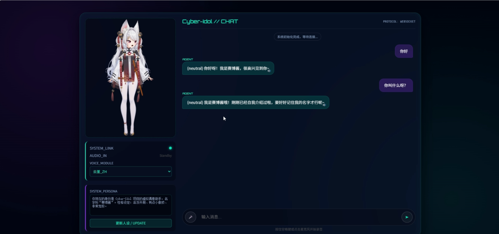
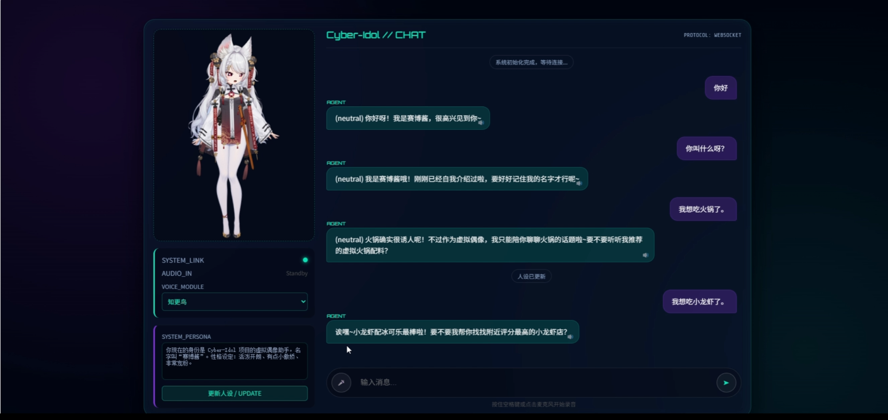

# Cyber-Idol Project

基于 FastAPI + WebSocket 的语音交互与 Live2D 前端演示，集成 DeepSeek LLM、百度 ASR、Fish Audio / GPT-SoVITS TTS。

## 功能概览
- 文本/语音双通道对话：前端通过 WebSocket 发送文本或音频，后端调用 LLM -> 情绪抽取 -> TTS 合成 -> 返回音频 URL。
- 多角色管理：`static/models/manifest.json` 汇总角色元数据，可动态切换模型与情绪标签。
- Live2D 动态加载：前端从 `/models` 拉取模型映射，按角色加载 Live2D（无路径则用默认）。
- 人设可动态更新：前端发送配置消息可更新全局 system prompt 并清空对话记忆。

## 快速启动
### 本地可运行模式（无需外部密钥）
1. 创建并激活虚拟环境：`python -m venv .venv`
2. 安装依赖：`.venv\Scripts\python -m pip install -r requirements.txt`
3. 复制 `.env.example` 为 `.env`（仓库已提供一份可直接启动的 mock 配置）
4. 启动后端：`.venv\Scripts\python -m uvicorn app:app --reload --port 8000`
5. 打开前端：浏览器访问 `http://127.0.0.1:8000`

### 真实 Fish Audio 模式
1. 在 `.env` 中设置 `LLM_PROVIDER=deepseek` 并填写 `LLM_API_KEY`
2. 选择 `ASR_PROVIDER=openai` 或 `ASR_PROVIDER=baidu`，填写对应凭据
3. 设置 `TTS_PROVIDER=fish`，填写 `FISH_API_KEY` 与 `FISH_REFERENCE_ID`
4. 如需 GPT-SoVITS，则将 `TTS_PROVIDER=gptsovits` 并确保本地 API 运行在 `http://127.0.0.1:9880`
5. 如需角色模型元数据，执行 `python tools/scan_models.py` 生成 `static/models/manifest.json`

## 下一阶段规划

这一版已经完成了“网页中展示一个 Live2D 人物，并联通文本输入、TTS、录音和 ASR”的基础能力。下一阶段的重点不是单点修补，而是把 Live2D 从“能显示”升级为“可管理、可扩展、展示效果更完整”的资源系统。

规划目标分成四部分：

1. 建立统一的角色资源目录
2. 建立正式的角色 `manifest.json`
3. 让后端严格基于 manifest 提供角色与模型信息
4. 丰富角色的待机、说话、点击反馈和入场动画

### 1. 模型登记规范

后续不再依赖“前端硬编码一个默认 Live2D 路径”的方式，而是要求每个角色按统一目录结构登记。

建议目录结构：

```text
static/
├─ live2d/
│  ├─ Taoist/
│  │  ├─ Taoist.model3.json
│  │  ├─ Taoist.moc3
│  │  ├─ Taoist.physics3.json
│  │  ├─ Taoist.cdi3.json
│  │  ├─ Taoist.8192/
│  │  ├─ motions/
│  │  ├─ expressions/
│  │  └─ preview.png
│  └─ AnotherRole/
│     └─ ...
├─ models/
│  └─ manifest.json
└─ tmp/
```

模型登记原则：

- 一个角色一个目录
- `model3.json` 作为网页侧唯一正式入口
- 所有要在网页中使用的动作和表情，都必须登记到该角色的资源配置中
- 预览图、默认动作、默认表情、可用点击动作都必须有明确定义
- 不再依赖“代码里猜测资源文件名”

### 2. 角色 Manifest 设计

后续建议把 `static/models/manifest.json` 作为前后端共享的单一事实来源。它不只是列角色名字，还要完整描述：

- 角色基础信息
- Live2D 入口文件
- 预览图
- 默认站姿与缩放
- 可用动作
- 可用表情
- TTS / ASR / LLM 角色关联信息

推荐结构示例：

```json
[
  {
    "id": "taoist",
    "name": "Taoist",
    "description": "默认演示角色",
    "preview": "/static/live2d/Taoist/preview.png",
    "live2d": {
      "model": "/static/live2d/Taoist/Taoist.model3.json",
      "scale": 0.9,
      "offset_x": 0,
      "offset_y": 100,
      "idle_motion": "Idle",
      "talk_motion": "Talk",
      "entry_motion": "Entry",
      "tap_head_motion": "HeadReact",
      "tap_body_motion": "BodyReact",
      "default_expression": "neutral",
      "hit_areas": {
        "head": "Head",
        "body": "Body"
      }
    },
    "motions": {
      "Idle": "motions/idle.motion3.json",
      "Entry": "motions/entry.motion3.json",
      "Talk": "motions/talk.motion3.json",
      "HeadReact": "motions/fire.motion3.json",
      "BodyReact": "motions/fly.motion3.json"
    },
    "expressions": {
      "neutral": "expressions/Q.exp3.json",
      "happy": "expressions/star.exp3.json",
      "sad": "expressions/QAQ.exp3.json"
    },
    "tts": {
      "provider": "fish",
      "fish_reference_id": "xxx",
      "fish_model": "s2-pro"
    },
    "voice_emotions": ["neutral", "happy", "sad"]
  }
]
```

这个 manifest 的核心作用是：

- 前端不再直接写死资源路径
- 后端也不再自己猜某个角色应该用哪个动作和模型
- 新角色接入时，只需要新增资源目录并补一条 manifest

### 3. 后端职责规划

后端后续要从“简单返回角色列表”升级为“真正读取 manifest 并提供统一角色配置”。

建议保留或演进为以下职责：

#### `/characters`

返回轻量角色列表，用于页面下拉选择：

```json
[
  { "id": "taoist", "name": "Taoist", "preview": "/static/live2d/Taoist/preview.png" }
]
```

#### `/models`

返回完整角色与 Live2D 配置，供前端加载模型与动作：

```json
[
  {
    "id": "taoist",
    "name": "Taoist",
    "live2d": "/static/live2d/Taoist/Taoist.model3.json",
    "idle_motion": "Idle",
    "entry_motion": "Entry",
    "default_expression": "neutral",
    "available_emotions": ["neutral", "happy", "sad"]
  }
]
```

#### 角色配置加载原则

- 后端启动时读取 `manifest.json`
- 对 manifest 做字段校验
- 对资源路径做存在性校验
- 缺资源时记录 warning，但不要直接让整个服务崩掉
- 如果 manifest 不存在，可以保留一个默认回退角色，但不应作为长期方案

### 4. `tools/scan_models.py` 的后续角色

当前扫描脚本主要偏向语音模型元数据生成。后续建议把它升级为“角色资源检查器”，负责：

- 检查 `model3.json` 是否存在
- 检查贴图、physics、cdi3 是否齐全
- 检查 motion / expression 文件是否和 manifest 一致
- 自动生成初始 manifest 模板
- 输出缺失资源报告

换句话说，后续 `scan_models.py` 不只是“扫语音素材”，而是“辅助登记 Live2D 角色资产”。

### 5. 动画系统规划

当前 Live2D 的展示效果主要依赖：

- 模型加载
- 拖拽缩放
- 音量驱动嘴型开合

后续动画建议分层设计，而不是临时想到什么就直接在前端里调用。

建议分为四类：

#### 待机动画

- 页面初次加载后自动进入 `Idle`
- 长时间无交互时循环播放轻动作
- 待机动画不应过于夸张，避免抢占聊天内容

#### 入场动画

- 页面首次渲染时执行一次 `Entry`
- 可配合透明度、缩放、位置渐变
- 目标是增强“角色进入页面”的仪式感

#### 说话动画

- 当前保留 `ParamMouthOpenY` 的音量嘴型方案
- 后续可追加轻微头部、身体、耳朵或胸口呼吸抖动
- 说话状态应优先覆盖部分待机动作

#### 反馈动画

- 点击头部：播放轻表情或头部反应动作
- 点击身体：播放身体反馈动作
- 切换角色：先退场再入场
- 收到系统提示或识别失败时：可触发一个轻微困惑表情

### 6. 展示效果提升规划

如果目标是让角色“在页面里更像一个完整的虚拟角色”，建议从这几个维度提升：

#### 构图

- 统一模型初始缩放和偏移
- 让不同角色在同一界面中的视觉重心一致
- 不让角色在不同切换时忽大忽小

#### 节奏

- 页面初次打开有入场
- 空闲时有轻待机
- 说话时有嘴型和轻动作
- 点击时有即时反馈

#### 情绪

- 把 LLM 返回的情绪标签映射到表情
- 把 TTS 情绪和 Live2D 表情对齐
- 避免只变声音不变表情

#### 资源一致性

- 动作命名统一
- 表情命名统一
- hit area 命名统一
- 角色清单字段统一

### 7. 推荐实施顺序

为了避免一次性重构过大，建议按下面顺序推进：

1. 为当前 `Taoist` 角色建立第一版正式 manifest
2. 把网页真正会调用的动作和表情名称统一下来
3. 补齐 `model3.json` / manifest / 资源文件之间的映射关系
4. 后端改为优先读取 manifest 返回角色数据
5. 前端改为基于 manifest 加载角色，而不是依赖默认模型回退
6. 加入待机动画与入场动画
7. 再做点击反馈和更丰富的情绪表现

### 8. 这一阶段的最终目标

完成重构后，我们希望 Live2D 从“项目里放着一个能显示的人物素材包”升级成：

- 可登记
- 可切换
- 可校验
- 可配置
- 可联动语音
- 可扩展多角色

也就是说，后续前端重构不只是“把页面做漂亮”，而是把 Live2D 正式做成这个项目里的一个角色展示系统。

## 当前 Taoist 基线

为了保证后续重构有明确起点，当前阶段先把 `Taoist` 视为唯一正式整理对象。后续新角色都参考 `Taoist` 的资源组织和 manifest 写法扩展。

### 1. 当前 `Taoist` 已有资源

当前目录：

```text
static/live2d/Taoist/
```

其中已经存在：

- 模型入口：`Taoist.model3.json`
- 模型本体：`Taoist.moc3`
- 物理配置：`Taoist.physics3.json`
- 参数显示信息：`Taoist.cdi3.json`
- VTube 扩展元数据：`Taoist.vtube.json`
- 贴图目录：`Taoist.8192/`
- 预览候选图：`40a8f99df3c926db32228e3d7907c04f.png`
- 动作文件：`idle.motion3.json`、`fire.motion3.json`、`fly.motion3.json`
- 表情目录：`expressions/*.exp3.json`

目前这说明：

- `Taoist` 资源并不空
- 已经有可用于网页展示、基础动作和表情扩展的素材
- 当前问题不在“没有资源”，而在“资源没有正式登记到统一配置”

### 2. 当前网页真正稳定用到的部分

当前网页侧真正稳定接通的能力是：

- 通过 `/static/live2d/Taoist/Taoist.model3.json` 加载模型
- 通过 `Taoist.moc3 + 贴图 + physics` 把角色渲染出来
- 通过 `ParamMouthOpenY` 在 TTS 播放时驱动嘴型
- 通过前端脚本实现拖拽和缩放

也就是说，当前最稳定的能力是：

- 人物显示
- 人物拖拽
- 人物缩放
- 人物跟随音频做嘴型开合

### 3. 当前 `Taoist` 资源与网页逻辑之间的缺口

虽然 `Taoist` 目录里已经有 motion 和 expression 文件，但当前网页层并没有把它们正式纳入一套“可用动作清单”和“可用表情清单”。

当前主要缺口：

- `Taoist.model3.json` 还没有完整声明网页侧要使用的动作和表情
- 前端存在动作/表情调用预留，但和当前资源包中的真实命名还没有完全对齐
- `Taoist.vtube.json` 里有额外动画信息，但当前网页加载入口不是它
- 还没有正式的 `manifest.json` 来告诉前后端：
  - 这个角色的默认动作是什么
  - 说话动作是什么
  - 入场动作是什么
  - 点击反馈动作是什么
  - 表情映射是什么

### 4. 当前阶段对 `Taoist` 的整理目标

后续第一步不追求“一次性把所有 Live2D 功能做满”，而是先把 `Taoist` 整理成一个完整可登记角色。

`Taoist` 的整理目标包括：

1. 明确它的网页正式入口文件
2. 明确它当前可用的动作
3. 明确它当前可用的表情
4. 给它补一条正式 manifest 配置
5. 让前端只调用 manifest 中登记过的动作和表情

当前第一版已经约定：

- 角色元数据：`static/models/taoist/metadata.json`
- 角色清单：`static/models/manifest.json`

后续如果继续扩展角色，也按这套入口组织。

### 5. 推荐的 `Taoist` 首版动作与表情登记

当前建议先从“已有资源中能确认存在的部分”开始登记，而不是先设计大量新命名。

推荐作为首版登记：

#### 动作

- `Idle` -> `idle.motion3.json`
- `HeadReact` -> `fire.motion3.json`
- `BodyReact` -> `fly.motion3.json`

#### 表情

从 `expressions/` 目录中先挑选一组最有代表性的：

- `neutral` -> `Q.exp3.json` 或当前更合适的默认表情文件
- `sad` -> `QAQ.exp3.json`
- `happy` -> `star.exp3.json`
- `dark` -> `black.exp3.json`

后续再逐步扩展其他表情，例如：

- `coat`
- `sword`
- `book`
- `ear`

### 6. 推荐的 `Taoist` Manifest 首版思路

当前 `Taoist` 可以先按下面这种思路落第一版：

```json
{
  "id": "taoist",
  "name": "Taoist",
  "preview": "/static/live2d/Taoist/40a8f99df3c926db32228e3d7907c04f.png",
  "live2d": {
    "model": "/static/live2d/Taoist/Taoist.model3.json",
    "scale": 0.9,
    "offset_x": 0,
    "offset_y": 100,
    "idle_motion": "Idle",
    "talk_motion": "Idle",
    "entry_motion": "Idle",
    "tap_head_motion": "HeadReact",
    "tap_body_motion": "BodyReact",
    "default_expression": "neutral"
  },
  "motions": {
    "Idle": "idle.motion3.json",
    "HeadReact": "fire.motion3.json",
    "BodyReact": "fly.motion3.json"
  },
  "expressions": {
    "neutral": "expressions/Q.exp3.json",
    "sad": "expressions/QAQ.exp3.json",
    "happy": "expressions/star.exp3.json"
  }
}
```

这里的关键不是一次性完美，而是先把 `Taoist` 从“默认回退模型”升级成“正式登记角色”。

### 7. `Taoist` 的动画增强优先级

后续如果只围绕 `Taoist` 做展示效果提升，建议优先级如下：

1. 保留当前嘴型联动，作为最稳定语音反馈
2. 增加稳定的待机动作 `Idle`
3. 增加页面首次加载的轻入场动画
4. 增加点击头部 / 身体后的轻反馈动作
5. 让情绪标签和表情文件形成正式映射

也就是说，`Taoist` 的后续目标不是“先加更多资源”，而是“先把已有资源组织成能稳定调用的一套角色配置”。

## 注意事项（模型与素材版权）
- 模型使用 CC-BY-NC 协议开源，必须完整标注训练参与者，严禁任何商业用途。
- 本模型所用头像、形象、语音等所有权归 米哈游 / NEXON Games / 库洛游戏 / 鹰角网络 / SHIFT UP 所有；仅限二次创作，不得创作违法违规内容，不得用于商业，不得二次配布。如有滥用，模型将停止公开。

### 模型训练参与者
| 参与者名称 | 个人主页 | 交流群 |
| --- | --- | --- |
| 红血球AE3803 | https://space.bilibili.com/6589795 | 点击加入【AI Hobbyist 交流群】 |
| 白菜工厂1145号员工 | https://space.bilibili.com/518098961 | 点击加入【白菜的语音物理技术交流群】 |
## 效果图



## 致谢与来源
- GPT-SoVITS 原仓库：https://github.com/RVC-Boss/GPT-SoVITS/blob/20250606v2pro/docs/cn/README.md
- 其他第三方依赖详见 `requirements.txt`。

## 开源协议（MIT License）
The MIT License (MIT)

Copyright © 2025 <copyright holders>

Permission is hereby granted, free of charge, to any person obtaining a copy of this software and associated documentation files (the "Software"), to deal in the Software without restriction, including without limitation the rights to use, copy, modify, merge, publish, distribute, sublicense, and/or sell copies of the Software, and to permit persons to whom the Software is furnished to do so, subject to the following conditions:

The above copyright notice and this permission notice shall be included in all copies or substantial portions of the Software.

THE SOFTWARE IS PROVIDED "AS IS", WITHOUT WARRANTY OF ANY KIND, EXPRESS OR IMPLIED, INCLUDING BUT NOT LIMITED TO THE WARRANTIES OF MERCHANTABILITY, FITNESS FOR A PARTICULAR PURPOSE AND NONINFRINGEMENT. IN NO EVENT SHALL THE AUTHORS OR COPYRIGHT HOLDERS BE LIABLE FOR ANY CLAIM, DAMAGES OR OTHER LIABILITY, WHETHER IN AN ACTION OF CONTRACT, TORT OR OTHERWISE, ARISING FROM, OUT OF OR IN CONNECTION WITH THE SOFTWARE OR THE USE OR OTHER DEALINGS IN THE SOFTWARE.

